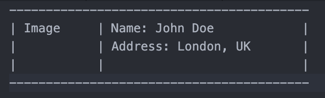
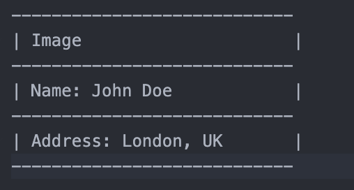

# Build a Responsive User Profile App with Dynamic Routing and Data Fetching

## Problem Description

Create a multi-page user profile app using **Next.js App Router** with the following features:

### 1. Home Page:
- Display a list of users fetched from the `https://dummyjson.com/users` API endpoint.
- Each user should be displayed in a grid with a responsive layout:
  - On **large screens**, show the user's image and name/address side by side.
    
  - On **small screens**, stack the content vertically with the image on top and the name and address below it.
    
    
  
### 2. Profile Page:
- When a user is clicked on from the Home Page, navigate to the **Profile Page** using dynamic routing that accepts the user’s **ID** (e.g., `/profile/[id]`).
- The **Profile Page** should display the detailed information of the selected user (fetched from `https://dummyjson.com/users/{id}`).
- Use the same layout you used for each user on the user list and add email on the bottom next to address

## Requirements:
1. **Responsive Design**:
   - Ensure the Home Page and Profile Page are responsive.
   - Display the user’s image and name/address side by side on large screens, and stack the content vertically on small screens.
   
2. **API Integration**:
   - Fetch the list of users from `https://dummyjson.com/users` for the Home Page.
   - Fetch detailed user data from `https://dummyjson.com/users/{id}` for the Profile Page.
   
3. **Dynamic Routing**:
   - Use **Next.js App Router** to implement dynamic routing with the user’s **ID**.
   - The route for the Profile Page should be `/profile/[id]`, where `[id]` is the dynamic user ID.
   
4. **State Management**:
   - Manage the state for storing the user data.
   
5. **TypeScript**:
   - Properly type the components and API responses.
   
6. **Error Handling**:
   - Show loading and error states while fetching data.

## Example API Responses:
### List of Users (`https://dummyjson.com/users`):
```json
{
  "users": [
    {
      "id": 1,
      "firstName": "Emily",
      "lastName": "Johnson",
      "maidenName": "Smith",
      "age": 28,
      "gender": "female",
      "email": "emily.johnson@x.dummyjson.com",
      "phone": "+81 965-431-3024",
      "username": "emilys",
      "password": "emilyspass",
      "birthDate": "1996-5-30",
      "image": "https://dummyjson.com/icon/emilys/128",
      "bloodGroup": "O-",
      "height": 193.24,
      "weight": 63.16,
      "eyeColor": "Green",
      "hair": {
        "color": "Brown",
        "type": "Curly"
      },
      "ip": "42.48.100.32",
      "address": {
        "address": "626 Main Street",
        "city": "Phoenix",
        "state": "Mississippi",
        "stateCode": "MS",
        "postalCode": "29112",
        "coordinates": {
          "lat": -77.16213,
          "lng": -92.084824
        },
        "country": "United States"
      },
      "macAddress": "47:fa:41:18:ec:eb",
      "university": "University of Wisconsin--Madison",
      "bank": {
        "cardExpire": "03/26",
        "cardNumber": "9289760655481815",
        "cardType": "Elo",
        "currency": "CNY",
        "iban": "YPUXISOBI7TTHPK2BR3HAIXL"
      },
      "company": {
        "department": "Engineering",
        "name": "Dooley, Kozey and Cronin",
        "title": "Sales Manager",
        "address": {
          "address": "263 Tenth Street",
          "city": "San Francisco",
          "state": "Wisconsin",
          "stateCode": "WI",
          "postalCode": "37657",
          "coordinates": {
            "lat": 71.814525,
            "lng": -161.150263
          },
          "country": "United States"
        }
      },
      "ein": "977-175",
      "ssn": "900-590-289",
      "userAgent": "Mozilla/5.0 (Macintosh; Intel Mac OS X 10_15_7) AppleWebKit/537.36 (KHTML, like Gecko) Chrome/96.0.4664.93 Safari/537.36",
      "crypto": {
        "coin": "Bitcoin",
        "wallet": "0xb9fc2fe63b2a6c003f1c324c3bfa53259162181a",
        "network": "Ethereum (ERC20)"
      },
      "role": "admin"
    },
    // more users
  ]
}
```

### List of Users (`https://dummyjson.com/users/[id]`):
```json
{
    "id": 3,
    "firstName": "Sophia",
    "lastName": "Brown",
    "maidenName": "",
    "age": 42,
    "gender": "female",
    "email": "sophia.brown@x.dummyjson.com",
    "phone": "+81 210-652-2785",
    "username": "sophiab",
    "password": "sophiabpass",
    "birthDate": "1982-11-6",
    "image": "https://dummyjson.com/icon/sophiab/128",
    "bloodGroup": "O-",
    "height": 177.72,
    "weight": 52.6,
    "eyeColor": "Hazel",
    "hair": {
        "color": "White",
        "type": "Wavy"
    },
    "ip": "214.225.51.195",
    "address": {
        "address": "1642 Ninth Street",
        "city": "Washington",
        "state": "Alabama",
        "stateCode": "AL",
        "postalCode": "32822",
        "coordinates": {
            "lat": 45.289366,
            "lng": 46.832664
        },
        "country": "United States"
    },
    "macAddress": "12:a3:d3:6f:5c:5b",
    "university": "Pepperdine University",
    "bank": {
        "cardExpire": "04/25",
        "cardNumber": "7795895470082859",
        "cardType": "Korean Express",
        "currency": "SEK",
        "iban": "90XYKT83LMM7AARZ8JN958JC"
    },
    "company": {
        "department": "Research and Development",
        "name": "Schiller - Zieme",
        "title": "Accountant",
        "address": {
            "address": "1896 Washington Street",
            "city": "Dallas",
            "state": "Nevada",
            "stateCode": "NV",
            "postalCode": "88511",
            "coordinates": {
                "lat": 20.086743,
                "lng": -34.577107
            },
            "country": "United States"
        }
    },
    "ein": "963-113",
    "ssn": "638-461-822",
    "userAgent": "Mozilla/5.0 (Windows NT 10.0; Win64; x64) AppleWebKit/537.36 (KHTML, like Gecko) Chrome/96.0.4664.45 Safari/537.36",
    "crypto": {
        "coin": "Bitcoin",
        "wallet": "0xb9fc2fe63b2a6c003f1c324c3bfa53259162181a",
        "network": "Ethereum (ERC20)"
    },
    "role": "admin"
}
```


## Getting Started

First, run the development server:

```bash
npm run dev
# or
yarn dev
# or
pnpm dev
# or
bun dev